> BV：BV1HM411377j   [ [GeekHour] 一小时Git教程](https://www.bilibili.com/video/BV1HM411377j?p=5&vd_source=8245c4f43a70376512e0aad9a5bb9494)

## 一、介绍

​	GIT是一个免费开源的 **分布式版本控制系统**，它使用一个特殊的叫做 仓库 的数据库，来记录文件的变化。仓库中的每个文件，都有一个完整的**版本历史记录**，可以看到 谁在什么时间 修改了哪些文件的 哪些内容。在需要的时候，也可以将文件恢复到 之前的某一个版本。

​	如果没有版本控制系统，那么就只能通过最原始的方式来管理文件。比如将文件按照日期备份出多的副本，或者将整个项目的每个版本，都保存在不同的文件夹中。而当很多项目成员，同时在**修改同一个项目**的时候，就需要手工来合并两个人的修改内容，这样不但低效，管理起来也非常麻烦。
​	版本控制系统，就是为了解决这些问题而诞生的，有了版本控制系统，我们就可以**跟踪每个文件的变化**，让项目成员之间的**协作更加高效**。目前世界上最流行的版本控制系统有两种，一种是集中式版本控制系统SVN CVS；另一种是分布式版本控制系统，比如Git Mercurial。

​	集中式版本控制系统的工作流程，就像下面这张图一样，所有的文件都保存在中央服务器上。每个人的电脑上就保存了一个副本。当你需要修改文件的时候，首先要从中央服器上下载最新版本，然后添加你想要的修改内容，修改完成之后再上传回中央服务器。
​		||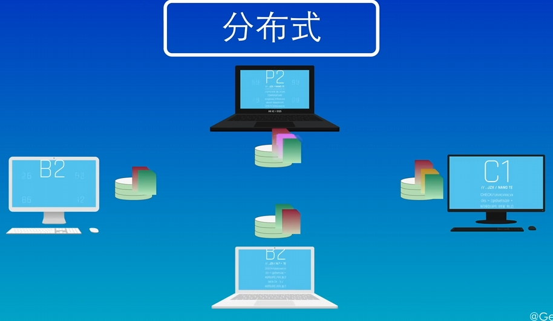|

​	集中式版本控制系统的优点是，使用简单，只需要从中央服务器上下载最新的版本，修改完成之后，再上传到中央服务器上；缺点是中央服务器的单点故障问题。如果中央服务器出现故障，或者网络连接出现问题，那么所有人都无法工作了，只能等待中央服务器或者网络恢复正常。
​	分布式版本控制系统没有这个问题。像图中，每个人在电脑上都有一个完整的版本库，以在本地进行修改，不需要考虑网络问题。这样即使中央服务器出现故障，也可以继续工作。当需要将修改内容分享给其他人的时候，只需将仓库互相同步一下就可以了。因为免费开源，速度快，功能强大，支持离线工作，分支管理强大等特性，git是目前世界上最先进的分布式版本控制系统之一，事情上超过90%的开源项目都在使用git进行版本控制。

## 二、Git的使用方式：

> 命令行	图形化界面(GUI)	IDE插件/ 扩展

Local(可以省略)：	本地配置，只对 本地仓库 有效
--global：	全局配置，所有仓库 生效
--system：	系统配置，对 所有用户 生效

### 1.初始化设置

配置用户名和邮箱，这样在提交的时候，才能够识别出来是谁提交的内容。这一步只需要执行一次。

```bash
git config --global user.name "Your Name"  # 配置用户名	这里因为用户名中间存在空格，所以使用双引号括起来
git config --global user.email "mail@example.com" # 配置邮箱
git config --global credential.helper store # 存储配置
```

保存用户名和密码，不用每次都输入

```bash
git config --global credential.helper store
```

查看用户的配置信息

```bash
git config --global --list 
```

> ```bash
> D:\RuanJian\OneDrive\DOCU\temp>git config --global --list
> ```
>
> ```txt
> filter.lfs.clean=git-lfs clean -- %f
> filter.lfs.smudge=git-lfs smudge -- %f
> filter.lfs.process=git-lfs filter-process
> filter.lfs.required=true
> user.name=JiangZhi-1
> user.email=3171207157@qq.com
> core.editor="D:\software\Microsoft VS Code\bin\code" --wait
> ```
>
> > filter.lfs是 **Git LFS (Large File Storage)** 的配置
> >
> > 当使用 `git lfs install` 或添加了 LFS 规则后，Git 会自动设置这些过滤器，
> > 用于追踪大文件（如图片、视频、数据库文件等），并将它们存储在远程服务器上，而不是直接存入 Git 仓库中。

---

### 2.仓库

版本库又叫仓库(repository,repo)，可以把仓库 理解成一个 目录，这个目录里面所有的文件，都可以被git管理。

仓库能跟踪到 每个文件的修改删除添加 等操作。任何时候，都可以跟踪历史，或还原到之前的某一个版本。

> 仓库里的特殊文件：
>
> ·git	仓库的元数据和对象数据库
> ·gitignore	忽略文件，不需要提交到仓库的文件
> ·gitattributes	指向当前分支的指针
> ·gitkeep	使空目录被提交到仓库
> ·gitmodules	记录子模块的信息
> ·gitconfig	记录仓库的配置信息

> 一些解释：
>
> main/master	默认主分支
> origin	默认远程仓库
> HEAD	指向当前分支的指针
> HEAD^	上一个版本
> HEAD~	上四个版本

创建一个仓库   —>   把一个目录，变成GIT可管理
两种方式来创建仓库：1.在自己电脑本地 创建一个仓库。2.从远程服务器上 克隆已存在仓库

> 创建仓库的示例过程：
>
> 创建一个空目录
> 输入git init，就可以创建一个仓库。
> 这个命令的回显，提示：已经初始化了一个空的仓库，在……下的.git位置.
> 命令行前面的路径多了一个main。main就是当前所在分支的名称，表示当前这个目录 已经被git的管理。
> 在这个目录下，有一个叫.git的目录，存放了git仓库的所有数据。

 **（1）创建**

```bash
# 将当前所在位置设为仓库
git init
# 创建一个新的本地仓库，在当前目录下新建个文件夹
git init <project-name>
# 克隆一个远程仓库
git clone <url>
```

**（2）添加和提交，查看状态**

```bash
# 添加一个文件到暂存区，比如git add。就表示添加所有文件到暂存区
# 不仅是添加，也可认为同步暂存区至与工作区状态相同。
git add <file>
# 提交所有暂存区的文件到本地仓库
git commit -m "message"
# 提交所有已修改的文件到本地仓库; git commit只会提交暂存区中的文件
git commit -am "message"
# 查看仓库的状态
git status 
# 查看暂存区有哪些文件
git ls-files
```

高级操作：

```bash
git add . # 把当前文件夹下的所有文件, 都添加到暂存区里
git add *.txt # 把所有以.txt结尾的文件, 都添加到暂存区里
git log # 查看提交记录
git log --oneline # 查看简洁的提交记录
```

**（3）回退提交状态**
		||

回退到某一版本，但是工作区和暂存区的文件保留情况不同。需要根据不同的场景来选择使用不同的参数。

> 比如 –soft : 假如回退到某个文件创建但没提交，这时候文件不会被删除，暂存区也有。
> 查看状态会显示这个文件已暂存未提交。
>
> –hard  会回退到和指定版本完全一样的状态。因为放在仓库的新文件没了，暂存区也没了。
>
> –soft 和 –mixed 的区别体现在，mixed模式需要执行 `git add` 操作，来将变动的内容重新暂存。
>
> –hard 谨慎使用hard这个参数，不小心误操作也不用担心，git中的所有操作都是可以回溯的。
> 使用 `git reflog` 命令，来查看操作历史记录

```bash
git reset --soft 5af90b8 # 加上要回退的版本ID
git reset --hard HEAD^ # 表示回退到上一个版本
```

---

### 3.工作过程与文件状态

​		|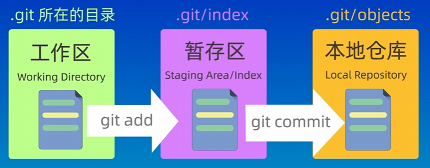|

**工作区** (Working Directory)	就是你在电脑里能实际看到的目录。
**暂存区** (Stage/Index)	暂存区也叫索引，用来临时存放未提交的内容，一般在.git目录下的index中。
**本地仓库**(Repository)	Git在本地的版本库，仓库信息存储在.git这个隐藏目录中。
远程仓库（RemoteRepository）	托管在远程服务器上的仓库。常用的有GitHub、GitLab、Gitee。

**文件状态：**
		|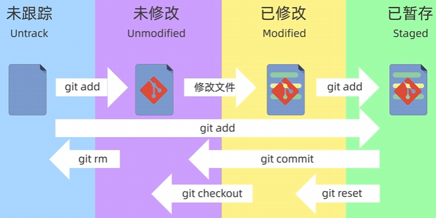|

未被跟踪 	Untracked files：红色
已修改 (Modified)	修改了 但是没有保存到 暂存区的文件。
已暂存 (staged)	（绿色，还会出现加号）修改后已经保存到暂存区的文件。
已提交（Committed)	把暂存区的文件提交 到本地仓库后的状态。
	|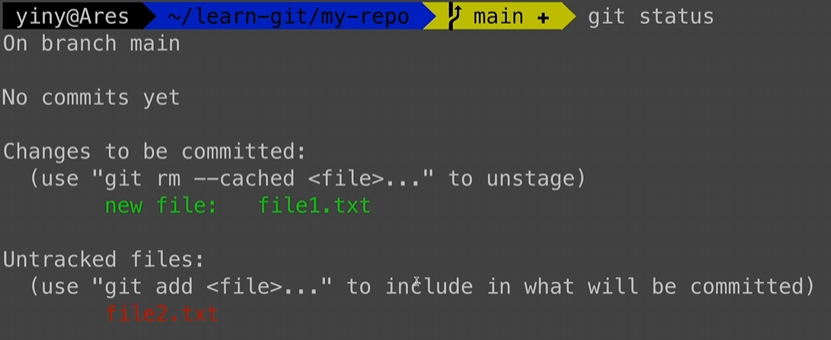|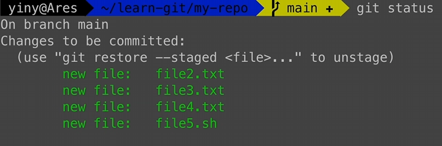|

### 4.常用指令及解释

> `git diff`

#### （1）**分支**

```bash
git branch
# 查看所有本地分支，当前分支前面会有一个星号*，-r查看远程分支，-a查看所有分支。

git branch <branch-name>
# 创建一个新的分支。

git checkout -b <branch-name>
# 切换到指定分支，并更新工作区。

git branch -d <branch-name>
# 删除一个已经合并的分支。

git checkout -D<branch-name>
# 删除一个分支，不管是否合并。

git tag <tag-name>
# 给当前的提交打上标签，通常用于版本发布。 

git squash <branch-name>
# 合并&挤压（squash）所有提交到一个提交。

git checkout <dev>
```

> ```bash
> git merge --no-ff -m message <branch-name>
> ```
>
> > 合并分支`，--no-ff` 参数表示禁用 `FastForward `模式，合并后的历史有分支 能看出 曾经做过合并。
> > 而-ff参数表示使用 `FastForward` 模式，合并后的历史 会变成一条直线
>
> |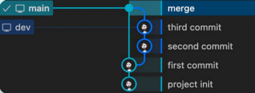|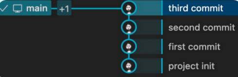|


> ```bash
> git rebase <main>
> ```
>
> > rebase操作可以把 本地未push的 分叉提交历史 整理成直线，看起来更加直观。
> > 但是，如果多人协作时，不要对已经推送到远程的分支，执行rebase操作
> >
> > rebase不会产生新的提交，而是把当前分支的 每一个提交，都“复制”到目标分支上，
> > 然后再把当前分支 指向目标分支，而merge会产生一个 新的提交，这个提交有两个分支的所有修改。
>
> |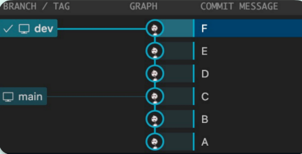|

#### （2）**撤销和恢复**

```bash
git mv <file> <new-file>
# 移动一个文件到新的位置。

git rm <file>
# 从工作区和暂存区删除一个文件，并且将这次删除放入暂存区。

git rm --cached <file>
# 从索引/暂存区中删除文件，但是本地工作区文件还在，只是不希望这个文件被版本控制。

git checkout <file> <commit-id>
# 恢复一个文件到之前的版本。

git revert <commit-id>
# 创建一个新的提交，用来撤销指定的提交，后者的所有变化将被前者抵消，并且应用到当前分支。

git reset --mixed <commit-id>
# 重置当前分支的HEAD为之前的某个提交，并且删除所有之后的提交。
--hard 参数表示重置工作区和暂存区，
--Soft 参数表示重置暂存区，
--mixed 参数表示重置工作区。

git restore --staged <file>
# 撤销暂存区的文件，重新放回工作区(git add的反向操作)。
```

#### （3）**查看状态或差异**

```bash
git status
# 查看仓库状态，列出还未提交的新的或修改的文件。

git log --oneline
# 查看提交历史，--oneline表示简介模式。

git diff
# 查看未暂存的文件更新了哪些部分。

git diff <commit-id> <commit-id>
# 查看两个提交之间的差异。
```

#### （4）**Stash**

```bash
git stash save "message"
# Stash操作可以把当前工作现场“储藏”起来，等以后恢复现场后继续工作。
-u参数表示把所有未跟踪的文件也一并存储；
-a参数表示把所有未跟踪的文件和忽略的文件也一并存储；
save参数表示存储的信息，可以不写。

git stash list
# 查看所有stash

git stash pop
# 恢复最近一次stash

git stash pop stash@{2}
# 恢复指定的stash，stash@{2}表示第三个stash，stash@{0}表示最近的stash

git stash apply
# 重新接受最近一次stash

git stash drop stash@{2}
# pop和apply的区别是, pop会把stash内容删除, 而apply不会
# 可以使用git stash drop来删除stash。

git stash clear
# 删除所有stash。
```

#### （5）**远程仓库**

```bash
git remote add <remote-name> <remote-url>
# 添加远程仓库。

git remote -v
# 查看远程仓库。

git remote rm <remote-name>
# 删除远程仓库。

git remote rename<old-name> <new-name>
# 重命名远程仓库。

git pull <remote-name> <branch-name>
# 从远程仓库拉取代码。默认拉取远程仓库名origin的master或者main分支

git pull --rebase
# 将本地改动的代码rebase到远程仓库的最新代码上 (为了有一个干净、线性的提交历史)

git push <remote-name> <branch-name>
# 推送代码到远程仓库（然后再发起pull request)

git fetchn <remote-name>
# 获取所有远程分支

git branch -r
# 查看远程分支

git fetch <remote-name> <branch-name>
# Fetch某一个特定的远程分支
```

#### （6）查看配置

```bash
git config --list
# 查看所有配置（全局 + 项目级）

git config --global --list
# 只查看全局配置

git config --local --list
# 只查看当前仓库的本地配置

git config --list --show-origin
# 查看配置来源
```


### 5. GitFlow

GitFlow是一种流程模型，用于在Git上管理软件开发项目。

> 主分支（master/main）：代表了项目的稳定版本，每个提交到主分支的代码都应该是经过测试和审核的。
>
> 开发分支（develop）：用于日常开发。所有的功能分支、发布分支和修补分支都应该从开发分支派生出来。
>
> 功能分支（feature）：用于开发单独的功能或者特性。每个功能分支都应该从开发分支派生，
> 	并在开发完成后合并回开发分支。
>
> 发布分支（release）：用于准备项目发布。发布分支应该从开发分支派生，
> 	并在准备好发布版本后合并回主分支和开发分支。
>
> 热修复分支（hotfix）：用于修复主分支上的紧急问题。
> 	热修复分支应该从主分支派生，并在修复完成后，合并回主分支和开发分支。

## 三、连接设置

> 远程仓库地址的两种方式：
> SSH HTTPS
>
> HTTPS开头的方式，在把本地代码push到远程仓库时，需要验证用户名和密码
>
> 而git开头的方式使用的是SSH协议，在推送的时候不需要验证用户名和密码，
> 但是需要在GitHub上 添加SSH公钥的配置，

### 1. SSH连接

[解释指令和公钥密钥](D:\BaiduSyncdisk\DOCU\开发技术文档（技术基建）\git-ssh_key.md)

#### （1）执行：

```bash
cd "C:\Users\31712\.ssh"
ssh-keygen -t rsa -b 4096
```

> -t ： 指定协议为RSA
> -b： 指定生成的大小为4096

​	|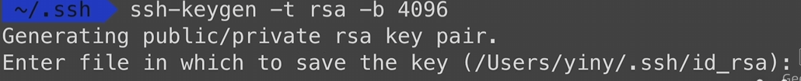|

#### （2）生成密钥文件

第一次执行ssh-keygen会出现上面提示，直接enter就行。(会在用户根目录的.ssh目录下 生成一个id_rsa密钥文件)

如果不是第一次，就输入……(字符串)。如果不是第一次，就指定

> 没有任何扩展名的……就是私钥文件
> .pub结尾的文件，是公钥文件

#### （3）配置网站

再打开网站，进入SSH和GPG密钥配置选项   —>   新建SSH密钥的按钮   —>   把复制的公钥内容粘贴

如果指定了一个新的文件名，比如(2)中新建了密钥文件
需要创建一个config文件，并把下面这5行内容添加到文件里面

​	|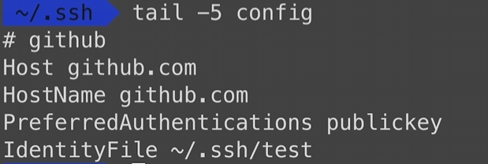|

```bash
tail -5 config
# github
Host github.com
HostName github.com
PreferredAuthentications publickey
IdentityFile ~/.ssh/test
```

#### （4）同步本地仓库和远程仓库

​	|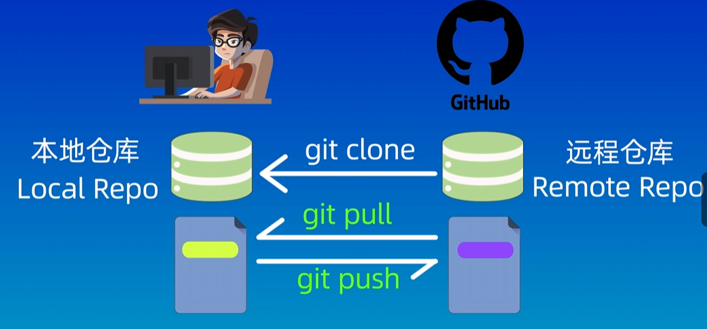|

> 推送 `push` ，和拉取 `pull` 

---


## 四、连接至远程仓库

| 命令                                       | 作用                                                         |
| ------------------------------------------ | ------------------------------------------------------------ |
| `git remote add <name> <URL>`              | 添加一个名为 `<name>`(方便操作的别名) 的远程仓库，地址为 `<URL>`<br />(`<URL>` 对应托管网站上的 克隆/下载 的位置) |
| `git remote -v`                            | 查看所有远程仓库的别名和对应的地址URL(包括 fetch 和 push 地址)，<br />(`-v` 参数表示“verbose” (详细模式)，会显示远程仓库的读fetch和写push地址) |
| `git remote set-url <shortname> <new-url>` | 修改远程地址                                                 |
| `git remote remove <shortname>`            | 删除远程地址                                                 |

打开AI的**解释**：	[添加远程仓库的指令解释](D:\BaiduSyncdisk\DOCU\开发技术文档（技术基建）\git-add_remote_repo.md)

### 1. 添加远程仓库

```bash
git remote add origin https://gitee.com/LittleWorkhorseProMax/test.git
git remote add notes git@gitee.com:LittleWorkhorseProMax/notes.git

git remote -v
# 查看远程仓库。
```

### 2. 指定分支名称（此步可省略）

```bash
git branch -M main
```

### 3. 推送与关联

把本地仓库的^……^分支，推送到远程仓库的^……^分支里（在已经 `git add` 和 `git commit` 之后）

> -u 是 upstream 的缩写
> 	把本地的main分支，和别名为 origin 的远程仓库的 main分支，关联起来。
> 	本地分支名:远程分支名
>
> 

```bash
git push -u origin main
# 或者全写：
git push -u origin main:main
# 如本地分支的名称 与远程分支名称相同，可省略只写一个main
git push -u origin "master"
```

---


## 五、仓库相关设置

### 1. 文件换行符设置

> warning: in the working copy of 'DOCU/学习笔记与教程（学习沉淀）/计算机基础/C++笔记MD/.obsidian/core-plugins.json', LF will be replaced by CRLF the next time Git touches it
> warning: in the working copy of 'DOCU/学习笔记与教程（学习沉淀）/计算机基础/C++笔记MD/.obsidian/graph.json', LF will be replaced by CRLF the next time Git touches it
> warning: in the working copy of 'DOCU/学习笔记与教程（学习沉淀）/计算机基础/C++笔记MD/.obsidian/workspace.json', LF will be replaced by CRLF the next time Git touches it
> warning: in the working copy of 'DOCU/开发技术文档（技术基建）/专项项目/SRX后端开发/POSTMAN测试/接口.md', LF will be replaced by CRLF the next time Git touches it

（1）为什么会出现这些？

**原因解释**：	这是由于不同操作系统对**换行符**的处理方式不同：

> - **Linux / macOS** 使用 `LF`（Line Feed，`\n`）
> - **Windows** 使用 `CRLF`（Carriage Return + Line Feed，`\r\n`）
>
> Git 在 Windows 上默认启用了自动换行符转换功能（通过配置 `core.autocrlf=true`）。当你把文件加入暂存区时，Git 会在提交前将 `LF` 转为 `CRLF`（在检出时又转回来），以适配 Windows 环境。
>
> 这个警告只是提醒你：“这个文件目前是 LF 换行，但我之后操作它时会改成 CRLF”。


（2）当出现上面的提示时(可能在第一次在第一次初始化一个文件夹为仓库时)，可以进行以下设置：

* 在项目根目录添加 `.gitattributes` 文件，明确指定换行规则（和 `.git` 文件夹同级）

下面是 `.gitattributes` 文件示例内容：

```bash
# ===================================================================
# 1. 自动检测文本文件
# ===================================================================
* text=auto

# 解释：Git 会自动判断哪些是文本文件，哪些是二进制文件
# 文本文件才会进行换行符转换，二进制文件（如图片）不会动

# ===================================================================
# 2. 明确指定各类文件的换行行为
# ===================================================================

# 所有文本类配置文件，在 Windows 上检出时使用 CRLF（兼容性好）
*.json     text eol=crlf
*.yml      text eol=crlf
*.yaml     text eol=crlf
*.md       text eol=crlf
*.txt      text eol=crlf
*.xml      text eol=crlf
*.html     text eol=crlf
*.css      text eol=crlf
*.js       text eol=crlf
*.ts       text eol=crlf
*.toml     text eol=crlf
*.ini      text eol=crlf

# 脚本文件检出时强制使用 LF（Linux/macOS 兼容，避免 '\r': command not found 错误）
*.sh       text eol=lf
*.py       text eol=lf
*.rb       text eol=lf
*.pl       text eol=lf
Dockerfile text eol=lf
Makefile   text eol=lf

# ===================================================================
# 3. 特殊文件单独设置（可选）
# ===================================================================
# 如果某些文件你知道必须保持某种格式
DOCU/开发技术文档（技术基建）/专项项目/SRX后端开发/POSTMAN测试/接口.md text eol=crlf

# ===================================================================
# 4. 标记二进制文件（防止 Git 尝试当作文本处理）
# ===================================================================
*.png    binary
*.jpg    binary
*.jpeg   binary
*.gif    binary
*.pdf    binary
*.zip    binary
*.exe    binary
*.dll    binary
*.so     binary
*.a      binary
*.jar    binary

# 解释：binary 表示“不要做任何换行转换”，也便于 Git 显示 diff 时不乱解析
```

>  `eol=` 控制的是“**检出到工作区时**”的换行风格：
> （“检出” = “从仓库里取出某个版本的文件，放到你的电脑上供你使用”）
>
> - `eol=crlf` → 工作区文件是 CRLF
> - `eol=lf` → 工作区文件是 LF
>
> 而提交到仓库的所有文本文件都会统一转为 LF 存储（除非你禁用了 `text=auto`）


（3）**Git 内部是如何工作的？（简化流程）**

当你执行 `git add` 或 `git checkout` 时：

```
提交流程：
工作区文件 (CRLF 或 LF) 
   ↓ Git 根据 .gitattributes 判断
转换为 LF 存入仓库（统一存储）

检出流程：
仓库中的 LF 文件 
   ↓ 根据 .gitattributes 中的 eol=xxx
转换为 CRLF 或 LF 放入工作区
```

 所以：

> - 仓库里永远用 LF 存储（干净、标准）
> - 工作区按需转换（适应你的系统）


（4）**验证** `.gitattributes` 是否生效

使用 `git check-attr` 命令

```bash
git check-attr text -- DOCU/学习笔记与教程（学习沉淀）/计算机基础/C++笔记MD/NotOnlySuccessNote.md
```

 正常输出：

```
DOCU/学习笔记与教程（学习沉淀）/计算机基础/C++笔记MD/NotOnlySuccessNote.md: text: auto
```


### 2. 输出文件路径时格式

> 31712@LAPTOP-LM3BRQPG MINGW64 /d/资料/notes (master) $ git ls-files 
>
> .gitattributes DOCU/imgs/image-20251017173640824-1760693908155-1.png 
> DOCU/imgs/image-20251017173640824.png "DOCU/\345\255\246\344\271\240\347\254\224\350\256\260\344\270\216\346\225\231\347\250\213\357\274\210\345\255\246\344\271\240\346\262\211\346\267\200\357\274\211/VAD/\346\200\273\344\273\213\347\273\215.md" "DOCU/\345\255\246\344\271\240\347\254\224\350\256\260\344\270\216\346\225\231\347\250\213\357\274\210\345\255\246\344\271\240\346\262\211\346\267\200\357\274\211/VAD/\346\236\204\345\273\272\346\225\260\346\215\256\351\233\206.md"

提供的`git ls-files`输出中，确实包含了中文文件名和路径，但是它们是以UTF-8编码的字节形式（即转义序列）展示出来的。
默认情况下，Git 会将非 ASCII 字符（如中文）在命令行输出中进行 **转义显示**，以避免终端乱码或兼容性问题。

```bash
git config --global core.quotepath false
```

这个设置会告诉Git不要对非ASCII字符进行转义处理，从而使得像中文这样的字符可以正常显示。
就会直接显示原始的 Unicode 文件名，而不是转义序列，前提是终端支持 UTF-8 显示

### 3. 本地配置解释

`git config --local --list` 会列出当前 Git 仓库（即 .git/config 文件）中的所有本地配置项。

🔹`core.repositoryformatversion=0`

​	含义：表示这个 Git 仓库的格式版本号。

> **说明**：`0` 是标准的、最常见的仓库格式版本，表示这是一个普通的 Git 仓库，没有使用实验性或扩展功能。

🔹 `core.filemode=false`

​	含义：Git 是否跟踪文件的可执行权限变化（如 Linux/macOS 中的 `chmod +x`）。

> **说明**：
>
> - `false` 表示 Git **不会**检测文件权限的变化。
> - 这在 Windows 系统上很常见，因为 Windows 的文件系统对权限的支持不如 Unix-like 系统完善，所以通常设为 `false`，避免不必要的 diff 提示。

🔹 `core.bare=false`

​	含义：指定这个仓库是否是“裸仓库”（bare repository）。

> **说明**：
>
> - `false` 表示这是一个**工作仓库**（有工作区），你可以看到文件、编辑代码。
> - 如果是 `true`，则是一个裸仓库（通常用于服务器端），没有工作目录，只保存 Git 历史数据。

🔹 `core.logallrefupdates=true`

​	含义：是否启用对所有引用（ref）更新的日志记录（即 `.git/logs/` 目录下的日志）。

> **说明**：
>
> - `true` 表示 Git 会记录分支、标签等引用的每一次变更（比如谁在什么时候从哪个 commit 移动到了另一个 commit）。
> - 这对于恢复误删的分支或排查问题非常有用。
> - 一般在非裸仓库中默认开启。

🔹 `core.symlinks=false`

​	含义：Git 是否按照符号链接（symbolic link）来处理文件。

> **说明**：
>
> - `false` 表示 Git **不会**将符号链接还原为链接本身，而是当作普通文件处理。
> - 在 Windows 上，由于对符号链接支持有限或需要管理员权限，通常设为 `false`。
> - 如果你的项目中有软链接，在 Windows 上可能无法正确还原。

🔹 `core.ignorecase=true`

​	含义：是否忽略文件名的大小写。

> **说明**：
>
> - `true` 表示 Git 认为 `ReadMe.md` 和 `readme.md` 是同一个文件（不区分大小写）。
> - 这在 Windows 和 macOS（默认不区分大小写）文件系统中自动设置为 `true`。
> - 在 Linux 上通常是 `false`，因为 Linux 文件系统区分大小写。
> - 设置错误可能导致跨平台协作时出现问题（例如有人改了文件名大小写但 Git 没察觉）。

🔹 `remote.notes.url=git@gitee.com:LittleWorkhorseProMax/notes.git`

​	含义：定义了一个名为 `notes` 的远程仓库地址。

> **说明**：
>
> - 使用 SSH 协议（`git@...`）连接到 [Gitee](https://gitee.com) 托管平台。
> - 仓库路径是 `LittleWorkhorseProMax/notes.git`。
> - 名称为 `notes`，所以你可以用 `git push notes main` 来推送到这个远程仓库。

🔹 `remote.notes.fetch=+refs/heads/*:refs/remotes/notes/*`

​	含义：定义从 `notes` 远程仓库拉取（fetch）时的引用映射规则。

> **说明**：
>
> - `+refs/heads/*`：表示远程的所有分支（如 `main`, `dev` 等）。
> - `refs/remotes/notes/*`：表示将这些分支拉取后存储为本地的“远程跟踪分支”（如 `notes/main`, `notes/dev`）。
> - `+` 表示允许强制更新（即使不是快进也会更新）。
> - 这是标准的 fetch 配置，用于保持本地对远程分支的追踪。

 总结: 当前处于一个 **本地非裸 Git 仓库**，配置如下：

> - 运行在 Windows 环境（`filemode=false`, `symlinks=false`, `ignorecase=true` 可以佐证）。
> - 使用 Gitee 作为远程代码托管平台，远程别名为 `notes`。
> - 启用了引用更新日志（便于追踪分支变动）。
> - 不关心文件权限和符号链接，符合 Windows 特性。
>

---


### 4. 全局配置解释

> 31712@LAPTOP-LM3BRQPG MINGW64 /d/资料/notes (master)
> $ git config --global --list
>
> filter.lfs.clean=git-lfs clean -- %f
> filter.lfs.smudge=git-lfs smudge -- %f
> filter.lfs.process=git-lfs filter-process
> filter.lfs.required=true
> user.name=LittleWorkhorseProMax
> user.email=15430521+LittleWorkhorseProMax@user.noreply.gitee.com
> core.editor="D:\software\Microsoft VS Code\bin\code" --wait
> core.quotepath=false
> credential.https://gitee.com.provider=generic

（1） **Git LFS（Large File Storage）** 的配置

> 🔹 `filter.lfs.clean=git-lfs clean -- %f`  
>
> 🔹 `filter.lfs.smudge=git-lfs smudge -- %f`  
>
> 🔹 `filter.lfs.process=git-lfs filter-process`  
>
> 🔹 `filter.lfs.required=true`

Git LFS 是什么？  
	它是一个 Git 扩展，用于管理大文件（如图片、视频、数据集、二进制文件等），避免它们直接存储在 Git 历史中导致仓库膨胀。

**每项解释：**

> `clean`：当你把大文件提交到 Git 时，Git LFS 会用一个“指针文件”代替真实文件，这个命令负责“清理”并替换。
>
> `smudge`：当你从仓库检出（checkout）代码时，Git LFS 会用真实的大文件替换指针文件，这个命令负责“还原”。
>
> `process`：启用 Git LFS 的后台过滤进程，提升性能。
>
> `required=true`：表示如果某个文件被 LFS 跟踪了，就必须使用 LFS 来处理，否则操作会被拒绝。

总结：安装并启用了 Git LFS，用于管理大文件。通常项目中会有一个 `.gitattributes` 文件来指定哪些类型的文件走 LFS。


（2）🔹 `user.name=LittleWorkhorseProMax`

​	含义：你的 Git 提交用户名。

> **说明**：
>
> - 每次你提交代码（`git commit`），Git 都会记录是谁提交的。
> - 这个名字会显示在提交记录中（如 `Author: LittleWorkhorseProMax`）。
> - 它不一定是邮箱或真实姓名，只是一个标识符，在 Gitee/GitHub 上通常与你的账户名一致。


（3）🔹 `user.email=15430521+LittleWorkhorseProMax@user.noreply.gitee.com`

​	含义：你的 Git 提交邮箱地址

> **说明**：
>
> - 这是提交记录中的邮箱。
> - 你使用的是 Gitee 提供的 **隐私邮箱**（noreply 表示“不回复”）。
> - 格式 `15430521+用户名@user.noreply.gitee.com` 是 Gitee 自动生成的提交专用邮箱，可以保护你的真实邮箱不被公开。
> - Gitee 能识别这个邮箱并关联到你的账户，确保提交记录正确显示。

> 小知识：如果你希望别人能通过提交记录联系你，可以设置真实邮箱；否则推荐使用 noreply 邮箱保护隐私。


（4）🔹 `core.editor="D:\software\Microsoft VS Code\bin\code" --wait`

​	含义：指定 Git 使用哪个文本编辑器来输入提交信息（commit message）

> **说明**：
>
> - 当你运行 `git commit` 而不加 `-m "message"` 时，Git 会自动打开这个编辑器让你写提交说明。
> - 你设置的是 **Visual Studio Code**（VS Code）。
> - `--wait` 参数很重要：它让 Git 等待你关闭编辑器后再继续执行命令（否则会立即返回，提交失败）。

> 正确写法示例：（前提是 `code` 命令已加入系统 PATH）
> ```bash
> git config --global core.editor "code --wait"
> ```


（5）🔹 `core.quotepath=false`

​	含义：控制 Git 是否对包含非 ASCII 字符（如中文、日文等）的文件名进行转义。

> **说明**：
>
> - 默认为 `true`，会把 `文件名.txt` 显示成类似 `\346\200\241.txt` 的编码形式。
> - 设为 `false` 后，Git 能正常显示中文文件名，不会乱码或转义。
> - 特别适合在中文 Windows 系统上使用。


（6）🔹 `credential.https://gitee.com.provider=generic`

​	含义：告诉 Git 使用哪种方式来保存 HTTPS 协议下的账号密码（凭证）。

> **说明**：
>
> - `https://gitee.com`：表示这是针对 Gitee HTTPS 地址的配置。
> - `provider=generic`：表示使用操作系统的**通用凭据管理器**来存储密码。
>   - 在 Windows 上就是 **Windows 凭据管理器**（Credential Manager）。
>   - 在 macOS 上是 Keychain。
>   - 在 Linux 上可能是 libsecret 或 gnome-keyring。
> - 效果：你第一次用 HTTPS 推送时输入用户名密码后，Git 会将其保存，下次无需重复输入。

###  5. 状态信息

`git status --porcelain` 的输出格式是**稳定且机器可读的**，每一行代表一个文件的状态，格式为：

```
XY <文件路径>
```

其中：
- `X`：表示**暂存区（staging area）** 的状态（即 `git add` 后的状态）
- `Y`：表示**工作目录（working directory）** 的状态
- `<文件路径>`：文件名或路径，可能包含空格

以下是 `XY` 两字符组合的常见情况及其解释：

| XY    | 含义                           | 说明                                          |
| ----- | ------------------------------ | --------------------------------------------- |
| `  `  | 无变化                         | 文件干净，未修改                              |
| `M `  | 修改并已暂存                   | 工作区修改后执行了 `git add`                  |
| `  M` | 工作区修改未暂存               | 文件被修改，但未 `git add`                    |
| `MM`  | 已暂存修改，但工作区又有新修改 | 先 `add` 了修改，又改了文件                   |
| `A `  | 新增并已暂存                   | `git add` 新文件                              |
| `??`  | 未跟踪文件                     | 新文件未被 `git add`                          |
| `D `  | 已暂存删除                     | 执行了 `git rm <file>` 或 `git rm --cached`   |
| `  D` | 工作区删除但未暂存             | 手动删除文件，未 `git rm`                     |
| `DD`  | 已删除（暂存和工作区都删了）   | 罕见，通常 `D ` 即可                          |
| ` R`  | 重命名并已暂存                 | `git mv old new` 或 `git add new; git rm old` |
| `R?`  | 重命名后工作区有修改           | 重命名后文件又被修改                          |
| `C `  | 复制并已暂存                   | `git add` 了一个复制的文件                    |
| `AM`  | 新增并修改                     | 先 `git add` 新文件，又修改了它               |
| `AD`  | 新增后被删除                   | 极少见                                        |
| `AU`  | 新增文件存在合并冲突           | 罕见                                          |
| `UD`  | 冲突且已删除                   | 合并冲突后文件被删                            |
| `UU`  | 未合并（冲突）                 | 两个分支都修改了同一文件，需手动解决          |
| `  T` | 类型改变（如文件变链接）       | 文件类型发生变化                              |
| `T `  | 类型改变并已暂存               | 已 `git add` 类型变更                         |
